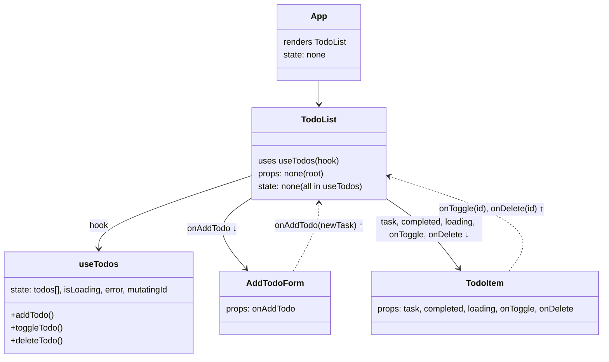

# Lab 4: Fetching Data. Custom Hooks

## Component Tree + State/Props Data Flow

---

## Requirements & Technologies

- **React Query** is used for all data fetching, mutations, and async state management.
- **Custom hook (`useTodos`)** encapsulates all todo state, API logic, and optimistic UI.
- **Todos are fetched from a fake API (DummyJSON).**
- **Adding new todos is handled locally** (per lab requirements for partial API, no external storage).
- **Toggling/deleting for local todos is handled in local state**; for server todos, via API.
- **Loading indicator and error messages are displayed in `TodoList`.**
- **A user can add, complete, and delete tasks.**
- **Completed tasks are visually distinct.**
- **State is colocated:**  
  - All todo state lives in the `useTodos` hook.  
  - `TodoList` and `TodoItem` receive state and handlers via props.
- **App is only a composition root** and holds no todo state.
- **Data flow is via props down and callbacks up** (see diagram).
- **Meets all base and bonus criteria** (React Query, best practices, diagram, clean UI, no unnecessary global state).

---
