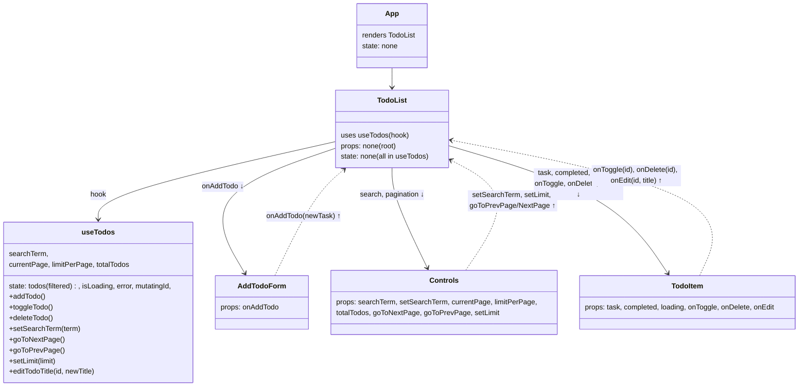

# Labs 5-6: React Design Patterns (Extended To-Do)

## Component Tree + Data Flow (Updated)

### Description

- **Composition Root**: `App` renders `TodoList`; it holds no todos state.
- **Single Source of Truth**: `useTodos` encapsulates fetching, pagination, search, and edit.
- **Unidirectional Data Flow**: props go down (`todos`, loading, pagination/search props), callbacks go up (`onAddTodo`, `onToggle`, `onDelete`, `onEdit`, pagination/search setters).
- **Partial API Requests**: list is fetched via `limit` and `skip`; no external storage.

### Used Patterns

- **Custom Hook for Data Logic** (`useTodos`) – encapsulates side effects, state, and CRUD.
- **Container/Presentational Split** – `TodoList` (container) composes presentational `AddTodoForm`, controls, and `TodoItem`.
- **Controlled Components** – search input, edit input, and pagination select are controlled.
- **Optimistic Updates** – toggle, delete, and edit use optimistic updates with rollback.
- **State Colocation** – editing UI state (`isEditing`, `draft`) inside `TodoItem`.

### API Notes

- List endpoint: `GET https://dummyjson.com/todos?limit={n}&skip={k}`
- Edit title: `PUT https://dummyjson.com/todos/{id}` with body `{ todo: "New title" }`
