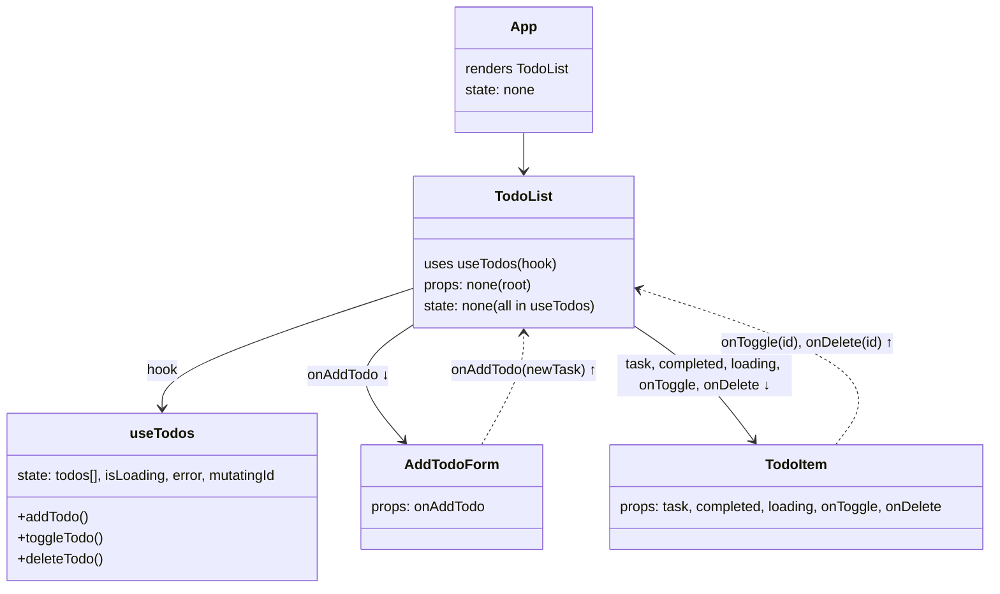

# Lab 4: Fetching Data. Custom Hooks

## Component Tree + State/Props Data Flow

---

- **React Query** is used for fetching and mutating todos.
- All todos state and API logic are in the custom `useTodos` hook.
- State and handlers are passed as props; callbacks go upward.
- App has no state and only renders components.

---
