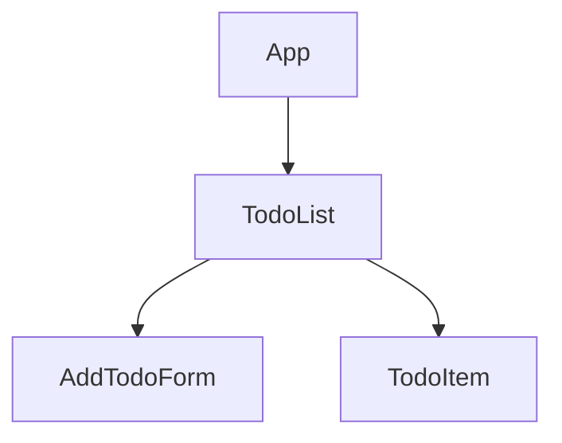

# Lab 3: Component Tree. Hooks

## Component Tree + Data Flow Diagram

### Description

- **App**
  - Renders `TodoList`

- **TodoList**
  - **State:** `todos[]`
  - **Props:** none (root)
  - Passes `onAddTodo` to `AddTodoForm`
  - Passes `task`, `onDelete` to each `TodoItem`

- **AddTodoForm**
  - **Props:** `onAddTodo`
  - Calls `onAddTodo(newTask)` upward

- **TodoItem**
  - **State:** `isCompleted`
  - **Props:** `task`, `onDelete`
  - Handles checkbox toggle (local state)
  - Calls `onDelete(id)` upward

**Data Flow:**  
- Props down: `task`, `onDelete`, `onAddTodo`
- Callbacks up: `onAddTodo(newTask)`, `onDelete(id)`