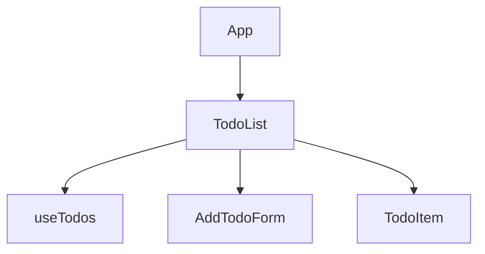

# Lab 4: Fetching Data. Custom Hooks

## Component Tree + Data Flow Diagram

**State & Props:**
- **App:**  
  - Renders `TodoList`.  
  - **No state.**
- **TodoList:**  
  - Uses `useTodos` custom hook.  
  - Receives and passes props/callbacks.
- **useTodos (custom hook):**  
  - Manages all todos state, API calls, and loading/error.
- **AddTodoForm:**  
  - Receives `onAddTodo` as prop, calls it upward.
- **TodoItem:**  
  - Receives `task`, `completed`, `loading`, `onToggle`, `onDelete` as props.

**Data Flow:**  
- **Props down:** `task`, `completed`, `loading`, `onToggle`, `onDelete`, `onAddTodo`
- **Callbacks up:** `onAddTodo(newTask)`, `onToggle(id)`, `onDelete(id)`

---

## Technologies & Patterns

- **React Query** for fetching/mutating todos (DummyJSON API)
- **Custom Hook:** `useTodos`
- **Optimistic UI** for toggle/delete
- **Props down, callbacks up**
- **Colocated state:** All todos/logic in the hook; App holds no state

---

## Requirements Met

- Loading indicator and error message handled in `TodoList`
- User can add, toggle, and remove tasks (local+API)
- Completed tasks styled distinctly
- State colocated in `useTodos`, not in App
- All data/handlers via props/callbacks

---
