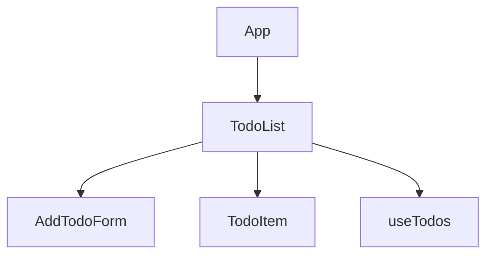
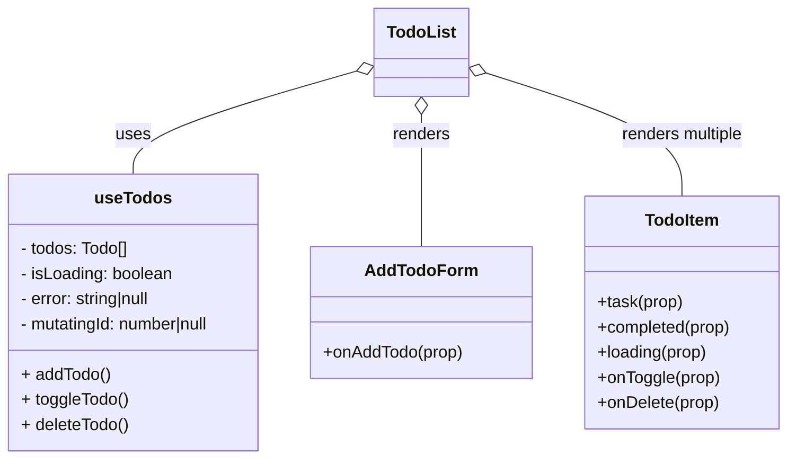

# Lab 4: Fetching Data. Custom Hooks

## Component Tree + Data Flow Diagram

### Description

- **App**
  - Composition root.  
  - Renders `TodoList`.  
  - Holds no todo state.

- **TodoList**
  - **State:** none (uses custom hook)
  - **Props:** none (at root)
  - **Uses:** `useTodos` custom hook for all todos logic & state
  - Passes `onAddTodo` to `AddTodoForm`
  - Passes `task`, `completed`, `loading`, `onToggle`, `onDelete` to each `TodoItem`

- **useTodos (custom hook)**
  - **State (internal):**  
    - `todos[]` (array of todo objects)
    - `isLoading`
    - `error`
    - `mutatingId` (id of item being toggled/deleted)
  - Handles API calls (GET, PUT, DELETE) and local optimistic updates
  - Returns state, props, and callback functions to `TodoList`

- **AddTodoForm**
  - **Props:** `onAddTodo`
  - Calls `onAddTodo(newTask)` upward

- **TodoItem**
  - **Props:** `task`, `completed`, `loading`, `onToggle`, `onDelete`
  - Handles checkbox toggle (`onToggle`) via prop (no local state for completed)
  - Handles delete via prop
  - Visually distinguishes completed tasks (line-through, faded)
  - Shows loading spinner if `loading` is true

**Data Flow:**  
- **Props down:**  
  - `task`, `completed`, `loading`, `onToggle`, `onDelete`, `onAddTodo`  
- **Callbacks up:**  
  - `onAddTodo(newTask)` (from AddTodoForm → TodoList → useTodos)  
  - `onToggle(id)` (from TodoItem → TodoList → useTodos)  
  - `onDelete(id)` (from TodoItem → TodoList → useTodos)

**State Flow:**
- All todo data, loading, and error state lives in the `useTodos` hook (colocation).
- App holds no state.
- TodoList and AddTodoForm receive data and handlers via props.
- Each TodoItem receives its own `completed` and `loading` via props, and calls handlers via props.

---

## Technologies & Patterns Used

- **React Query** for fetching and mutating todos (API: DummyJSON)
- **Custom Hook:** `useTodos`
- **Optimistic UI** for toggle and delete
- **Props-down, callbacks-up** data flow
- **Best practices:** separation of concerns, clean UI, no unnecessary global state

---

## Example State & Props Visualization

---

## Summary

- All state and API logic are encapsulated in the custom hook.
- Data and handlers are passed down via props; events bubble up via callbacks.
- React Query is used for best practice async state management.
- The UI remains clean, visually distinct, and responsive.
